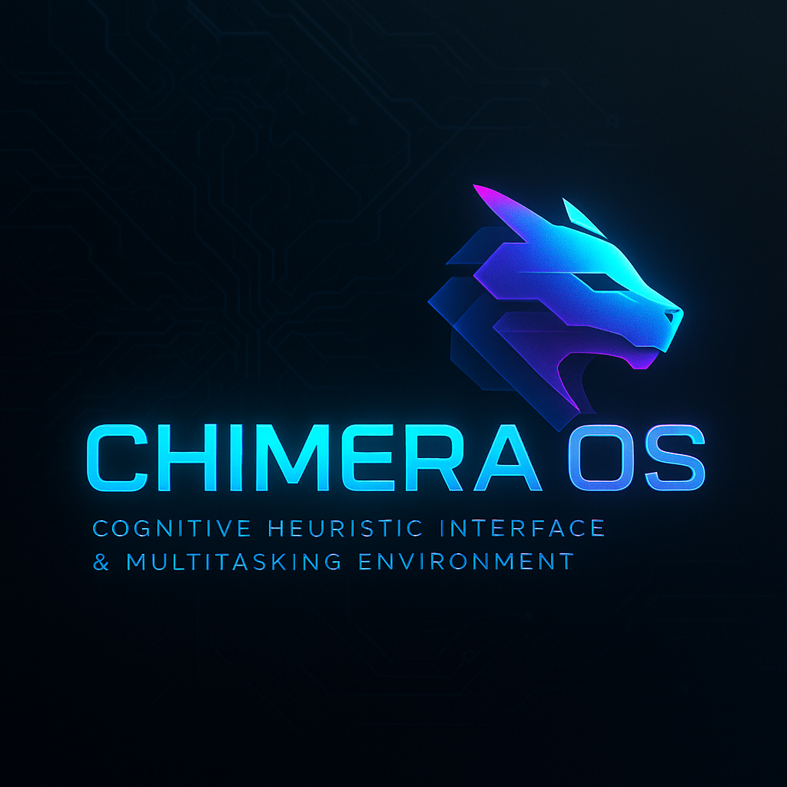

# Project CHIMERA - Cognitive Heuristic Interface & Multitasking Environment



Welcome to Project CHIMERA, a dynamic and customizable dashboard interface designed for multitasking and information management with a futuristic aesthetic.

## Features

*   **Customizable Dashboard:** Arrange and display various widgets to suit your needs.
*   **Multiple Layout Modes:**
    *   **Freeform Mode (Default):** Freely move and resize widgets on the dashboard.
    *   **Grid Mode:** Organizes widgets into a structured column-based layout.
*   **Variety of Widgets:**
    *   Clock Display
    *   Enviro-Scan (Weather)
    *   Chronometer (Calendar)
    *   Media Stream (YouTube Player)
    *   Newsfeed (RSS Reader)
    *   Market Watch (Stocks/Crypto via TradingView)
    *   Latin Proverb
    *   Nav Matrix (Quick Links)
    *   Audio Relay (Spotify Player)
    *   CHIMERA AI Chat (OpenAI Integration with Voice Input/Output)
    *   System Core (Mock system stats)
    *   Directives (Task List)
    *   Captain's Log (Notes)
    *   Nexus Visualizer (Particle Effects)
    *   Retro Snake Game
    *   Connection Monitor
*   **Theming:** Choose from multiple visual themes (Chimera Dark, Chimera Light, Cyber Blue).
*   **Background Effects:** Toggle subtle background particle animations.
*   **API Integration:** Supports OpenWeatherMap, YouTube Data API (for search), and OpenAI API.
*   **Local Storage:** Settings, widget configurations, and some widget data (like notes, tasks, chat history) are saved locally in your browser.
*   **Context Menu & Info Panel:** Easy access to settings, widget management, and help.

## For Users (Running the Interface)

The primary way to run Project CHIMERA is using the single, self-contained HTML file:

1.  **Download or Build:**
    *   **Releases:** Go to the [Releases Page](https://github.com/TVDOfficial/Project_CHIMERA/releases) of this GitHub repository. Download the latest `Project_CHIMERA-vX.X.X.zip` file. Unzip it, and inside the `dist` folder, you'll find `Chimera_Interface.html`.
    *   **Building from Source:** If you build the project yourself (see "Building for Distribution" below), the output will be `dist/Chimera_Interface.html`.
2.  **Open the File:**
    *   Navigate to where you have `Chimera_Interface.html` (either from a release or your own build's `dist` folder).
    *   Double-click the `Chimera_Interface.html` file to open it in your default web browser. It's designed to run directly from your file system.
3.  **API Keys:**
    *   For the CHIMERA AI Chat widget, you will need to provide your own OpenAI API key in the settings. Other widgets requiring API keys (Weather, YouTube search) will also need your keys for full functionality. These are stored locally in your browser.

**Interacting with the Interface:**

*   **Settings:** Access settings via the "Config" button in the Nav Matrix widget or by right-clicking on the dashboard background and selecting "Open Settings".
*   **Widget Management:** Add or remove widgets via "Manage Widgets" in the Settings panel (Display tab) or the right-click context menu.
*   **Layout:** Switch between Freeform and Grid layout modes in Settings (Display tab) or via the context menu.
*   **Information:** Click the <i class="fas fa-question-circle"></i> button in the bottom-right corner or use the context menu for a "How To & Info" panel.

## For Developers (Contributing or Building from Source)

If you wish to modify the code or build the project yourself:

**Prerequisites:**

*   **Node.js and npm:** Download and install from [nodejs.org](https://nodejs.org/). This is required to run the build scripts and the asset inlining tool.
*   **Git:** For cloning the repository.
*   **Check `Dependencies` Folder:** Please check the `Dependencies` folder (if present in the project root) for any additional required software or runtimes. Install them if you don't have them already.

**Setup & Development:**

1.  **Clone the Repository:**
    ```bash
    git clone https://github.com/TVDOfficial/Project_CHIMERA.git
    cd Project_CHIMERA
    ```

2.  **Install Dependencies:**
    *   First, check if there is an `npm_install.bat` file in the root of the project. If it exists, run it by double-clicking to ensure any project-specific installation steps are performed.
    *   If `npm_install.bat` is not present or after running it, open a terminal or command prompt in the project's root directory and run the standard npm install command. This will download Parcel (our bundler) and other development tools listed in `package.json`.
    ```bash
    npm install
    ```

3.  **Run the Development Server:**
    This command starts a local development server with Parcel, which will automatically re-bundle your code and refresh your browser when you make changes (Hot Module Replacement). This is recommended for active development.
    ```bash
    npm start
    ```
    Alternatively, on Windows, you can run the `start_dev_server.bat` script by double-clicking it. This script simply runs `npm start`.

    Parcel will typically open the interface at `http://localhost:1234` in your default browser. The development server does *not* produce the single, inlined HTML file; it serves assets normally for faster development.

**Building for Distribution:**

To create the single, optimized, self-contained `Chimera_Interface.html` file that users would typically use:

1.  **Run the Build Command:**
    ```bash
    npm run build
    ```
    Alternatively, on Windows, you can run the `build_project.bat` script by double-clicking it.

2.  This command performs a two-stage process:
    *   First, it uses Parcel to bundle all JavaScript, CSS, and other assets. Source maps are not generated to keep the output clean.
    *   Then, it runs a custom Node.js script (`inline-assets.js`) that takes the Parcel-generated `Chimera_Interface.html`, CSS, and JS files, and inlines all the local CSS and JavaScript directly into the HTML file.
    *   The original separate CSS and JS asset files are then deleted from the `dist` folder.

3.  **Output:**
    *   The final output is a single file: `dist/Chimera_Interface.html`.
    *   The `dist` folder will also contain any necessary image assets (like the logo and favicon) that are referenced by the HTML.

**Creating a New GitHub Release (After Building):**

1.  **Commit and Push Your Changes:** Make sure all your latest changes are committed to Git and pushed to your GitHub repository.
    ```bash
    git add .
    git commit -m "Your descriptive commit message (e.g., Release v1.1.0)"
    git push origin main # Or your default branch
    ```

2.  **Tag Your Release:** Create a Git tag for the new version.
    ```bash
    git tag v1.1.0
    git push origin v1.1.0 # Push the tag to GitHub
    ```
    (Replace `v1.1.0` with your actual new version number).

3.  **Go to Your GitHub Repository's "Releases" Page.**

4.  **Click "Draft a new release".**
    *   **Tag version:** Select the tag you just created.
    *   **Release title:** Typically the same as the tag.
    *   **Describe this release:** Summarize changes.
    *   **Attach binaries by dropping them here or selecting them:**
        *   After running `npm run build`, you will have a `dist/` folder.
        *   **Create a ZIP file** containing all the contents of the `dist/` folder (which will primarily be the `Chimera_Interface.html` file and any images). Name it something like `Project_CHIMERA-vX.X.X.zip`.
        *   Drag and drop this ZIP file into the "Attach binaries" area.
    *   Check "This is a pre-release" if applicable.
    *   Click "Publish release".

Now users can download the ZIP file containing the single `Chimera_Interface.html` and associated assets.

## File Structure

Project_CHIMERA/
├── Chimera_Interface.html # Main HTML source file
├── css/
│ ├── main.css # Core styles, layout, themes, modals
│ └── widgets.css # Styles specific to each widget
├── js/
│ ├── main.js # Core app logic, entry point (ES Module)
│ ├── config.js # Widget definitions metadata, constants
│ ├── utils.js # General utility functions
│ ├── particles.js # Background particle effects logic
│ └── widgets/ # Individual JavaScript modules for each widget
│ ├── timeWidget.js
│ ├── latinProverbsWidget.js
│ ├── stocksWidget.js
│ └── ... (other widget JS files)
├── images/ # Image assets (logo, favicon)
├── node_modules/ # (Generated by npm install, ignored by Git)
├── dist/ # (Generated by npm run build - contains the final inlined HTML and assets)
├── package.json # npm project configuration and scripts
├── inline-assets.js # Node.js script to inline CSS/JS into the final HTML
├── package-lock.json # npm dependency lock file
├── README.md # This file
└── .gitignore # Specifies intentionally untracked files that Git should ignore


## Contributing

Contributions, issues, and feature requests are welcome! Please feel free to check the [issues page](https://github.com/TVDOfficial/Project_CHIMERA/issues).

## Developer

*   **Mathew Pittard**
*   Email: <Pepper1848@hotmail.com>
*   GitHub: [TVDOfficial](https://github.com/TVDOfficial)

## License

This project is licensed under the **Creative Commons Attribution-NonCommercial 4.0 International (CC BY-NC 4.0) License**.

This means you are free to:
*   **Share** — copy and redistribute the material in any medium or format.
*   **Adapt** — remix, transform, and build upon the material.

Under the following conditions:
*   **Attribution:** You must give appropriate credit to Mathew Pittard, provide a link to this license, and indicate if changes were made. A link to the original GitHub repository ([https://github.com/TVDOfficial/Project_CHIMERA](https://github.com/TVDOfficial/Project_CHIMERA)) should be included.
*   **NonCommercial:** You may not use the material for commercial purposes.

For the full license text, please see the [LICENSE](LICENSE) file in this repository or visit [Creative Commons BY-NC 4.0](http://creativecommons.org/licenses/by-nc/4.0/).